# Argus 系統手冊 PlantUML 圖碼

本檔集中保存 `專題文件/Argus_系統手冊.docx` 中系統架構、需求模型、設計模型、實作模型與資料庫設計相關圖形的 PlantUML 原始碼。圖碼以 Argus 目前實際架構為準：React SPA、Django REST API、Celery/Redis、Playwright、PostgreSQL、點數計費、授權合規、AdminAuditLog 與可選 Hermes-Agent。

## 圖 3-1-1　Argus SaaS 分層系統架構圖

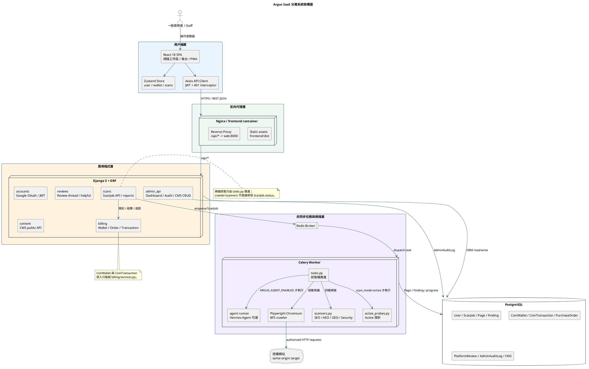

## 圖 3-1-2　掃描任務執行資料流圖

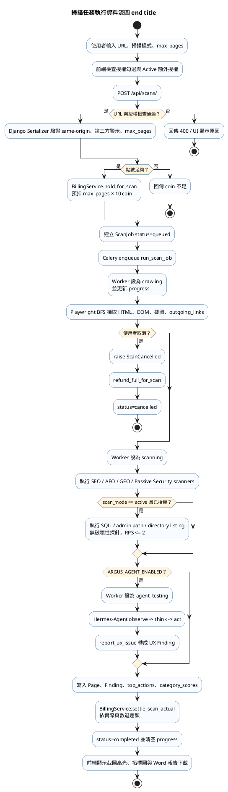

## 圖 3-1-3　ScanJob 核心狀態與橫切機制圖

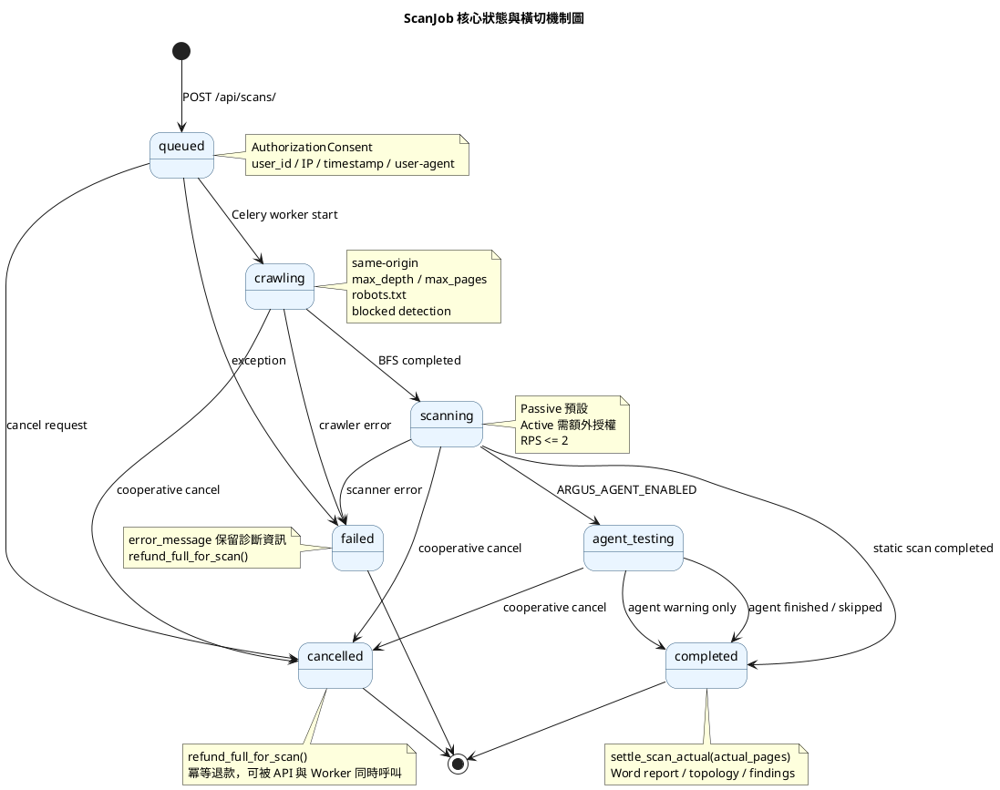

## 圖 5-2-1　使用個案圖（Use Case Diagram）

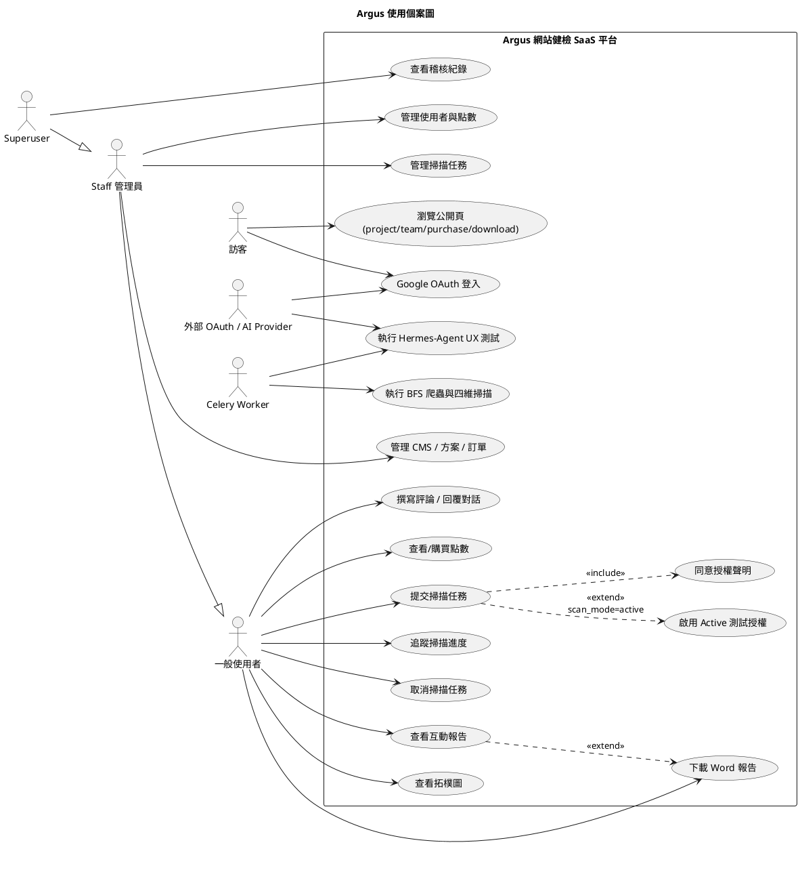

## 圖 5-3-1　活動圖：提交掃描任務（Activity Diagram）

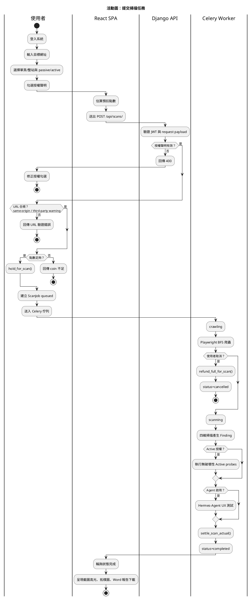

## 圖 5-4-1　分析類別圖（Analysis Class Diagram）

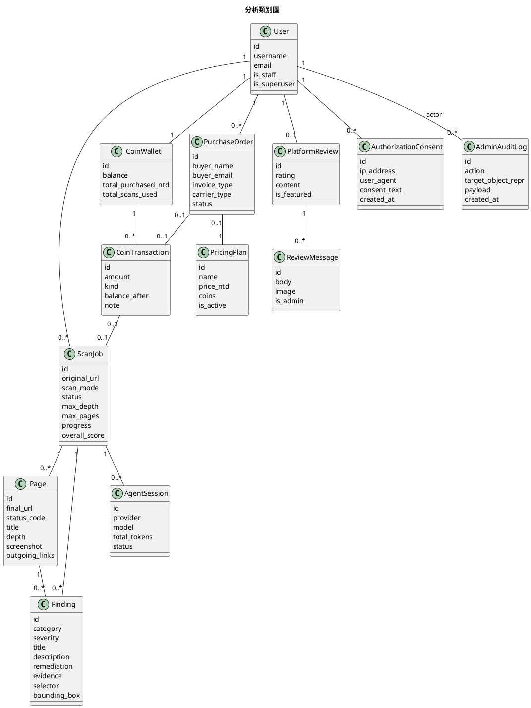

## 圖 6-1-1　掃描任務循序圖（Sequential Diagram）

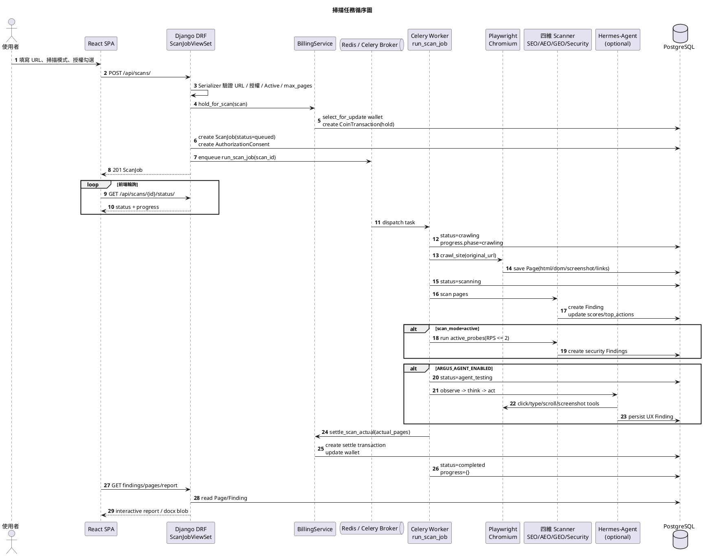

## 圖 6-2-1　設計類別圖（Design Class Diagram）

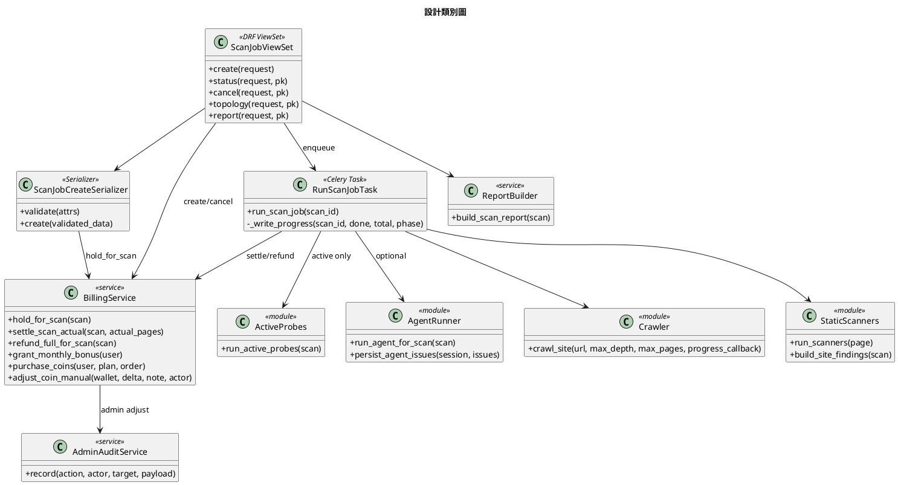

## 圖 7-1-1　Docker Compose 佈署圖（Deployment Diagram）

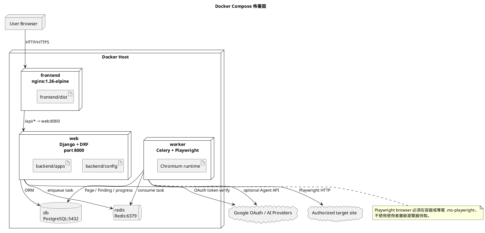

## 圖 7-2-1　套件架構圖（Package Diagram）

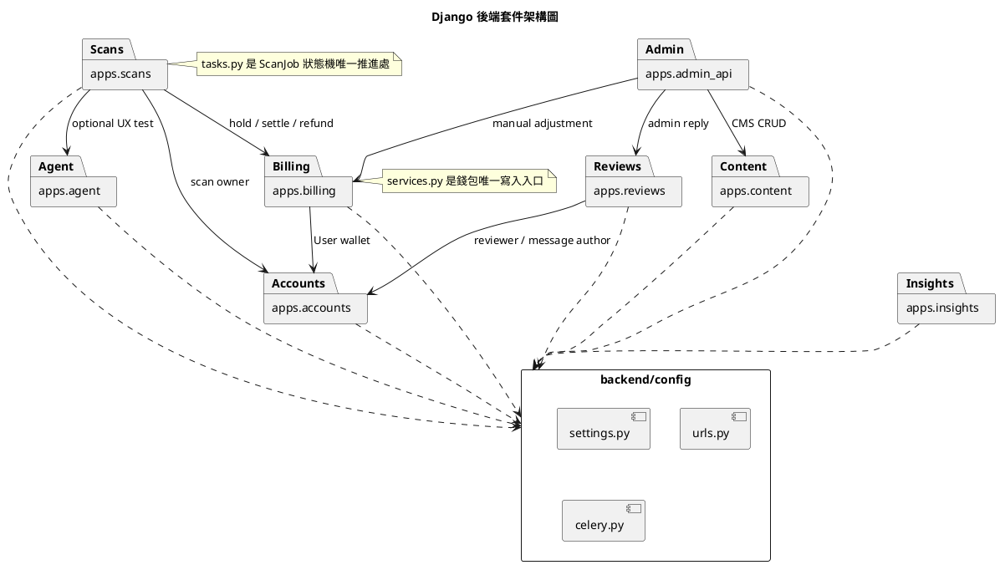

## 圖 7-3-1　系統元件圖（Component Diagram）

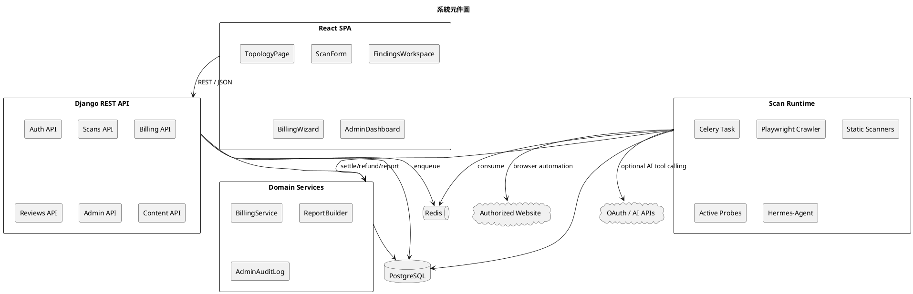

## 圖 7-4-1　ScanJob 狀態機圖（State Machine）

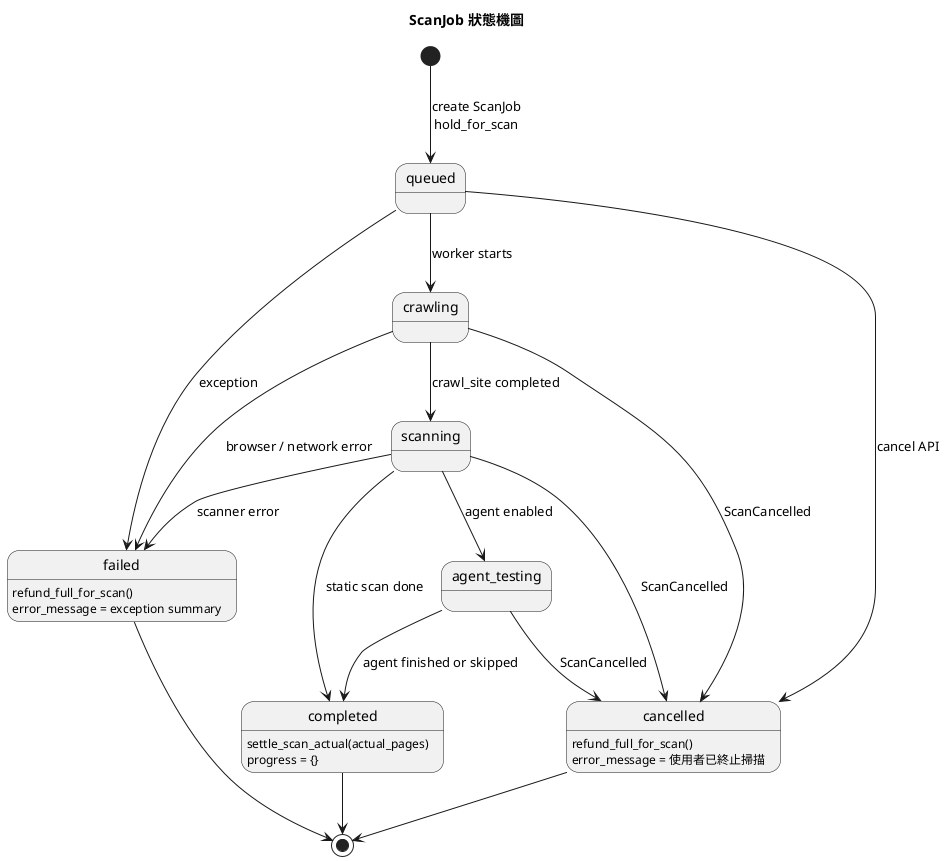

## 圖 8-1-1　資料庫 ER 圖（Entity-Relationship Diagram）

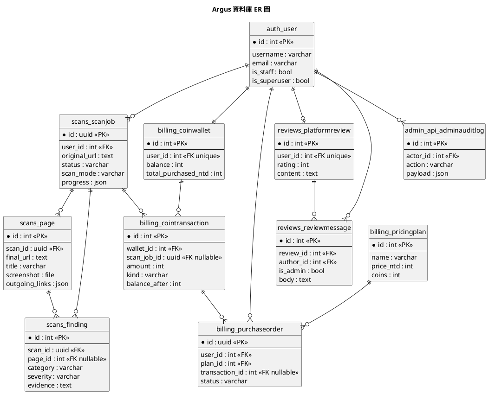
